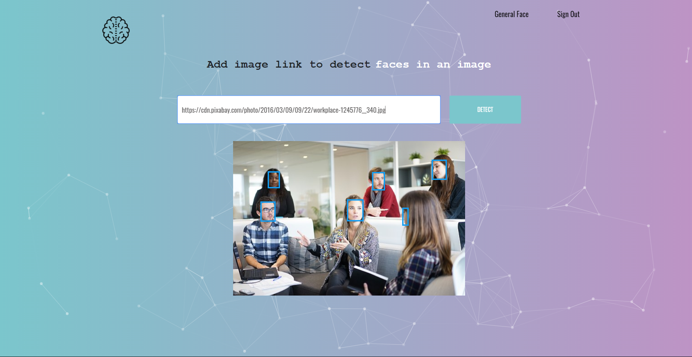

# Firebrain
[](https://app.netlify.com/sites/firebrain/deploys)



The first version of my face detection app built with **React** and hosted with [Netlify](https://www.netlify.com/).

👉Check it out: [FireBrain](https://firebrain.netlify.com/)

# ✨ How To Use
1. **Install and switch to the correct version of Node using NVM**

   ```sh
   nvm install
   ```
2. **Install dependencies**

   ```sh
   yarn install
   ```
3. **Start the development server**

   ```sh
   yarn start
   ```
## 🧐 What's inside?

A quick look at the top-level files and directories in this project.
    .
    ├── node_modules
    ├── public
    ├──── img
    ├──── index.html
    ├──── manifest.json
    ├──── robots.txt
    ├── src
    ├──── components
    ├──── App.js
    ├──── App.scss
    ├──── index.js
    ├──── index.scss
    ├── .gitignore
    ├── LICENSE
    ├── package.json
    ├── README.md
    ├── yarn.lock

# What's Next?
This App will be constantly updated to include more features like
* sign up
* Ranking
* More Recognition Models etc